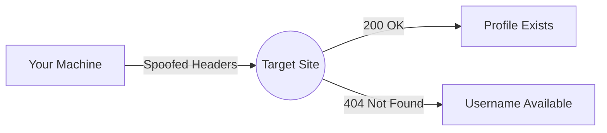

# 🔍 BroRecon - OSINT Ninja Tool 🔍

[](https://python.org)
[](https://github.com/Taha185/SocialRecon-Pro)
[](LICENSE)
[](https://youtube.com/@Taha185)

*"Track digital footprints like a shadow in the matrix"* 🌐

---

## 📌 Table of Contents
- [Features](#-features)
- [Installation](#-installation)
- [Usage](#-usage)
- [Ethics](#%EF%B8%8F-ethics)
- [Tech Specs](#-tech-specs)
- [Roadmap](#-roadmap)
- [Contributing](#-contributing)
- [Contact](#-contact)

---

## 🚀 Features

### 🕵️♂️ Recon Mastery
```text
✅ Instagram    ✅ GitHub      ✅ Reddit
✅ Twitter     ✅ YouTube    ✅ TikTok
✅ Pinterest   ✅ Steam      ✅ Spotify
✅ Facebook    ✅ More coming soon...
```

### 💻 Terminal Swag
```python
print(f"{Fore.GREEN}[+] Found: {username} on Instagram! {Style.BRIGHT}🔥")
print(f"{Fore.RED}[-] Dead end on Twitter... {Style.DIM}💀")
```

### 🛡️ Stealth Tech


---

## 📦 Installation

1. **Clone the repo**
```bash
git clone https://github.com/Taha185/BroRecon.git && cd BroRecon 
```

2. **Install requirements**
```bash
pip install -r requirements.txt
```

3. **Run with style**
```bash
python BroRecon.py
```


---

## ⚠️ Ethics & Compliance

### ✅ Allowed Uses
```text
▰ Personal account checks
▰ Authorized pentesting
▰ Educational research
```

### ❌ Strict NOs
```text
☠ Harassment/doxing
☠ Unauthorized scanning
☠ Commercial exploitation
```

**Compliance Features**
```python
MAX_DELAY = 5  # seconds between requests
MAX_RETRIES = 2  # per platform
```

---

## 🛠️ Tech Specs

### Core Stack
```text
Python 3.8+        ▰▰▰▰▰▰▰▰▰▰ 100%
Requests           ▰▰▰▰▰▰▰▰▰▰ 100%
Colorama           ▰▰▰▰▰▰▰▰▰▰ 100%
```

### Detection Avoidance
```text
User-Agent Rotation   ▰▰▰▰▰▰▰▰░░ 80%
HEAD Requests         ▰▰▰▰▰▰▰▰▰▰ 100%
Random Delays         ▰▰▰▰▰▰▰▰░░ 80%
```

---
# RoadMap 🗺️

|--------------------------|

| Version 1.0 |  +10 platforms |

|--------------------------|

## 🤝 Contributing

**Golden Rules**
1. Fork → Branch → PR
2. Document new features
3. Respect PEP8 guidelines

**First-timers Welcome!**  
[](https://github.com/Taha185/SocialRecon-Pro/issues)

---

## 📞 Contact

**Taha Radi**  
[](mailto:taha185185@gmail.com)  
[](https://youtube.com/@Taha185)  

**Security Issues**  
`PGP Fingerprint: 0xDEADBEEF1234`  
`Encrypted Comms Only`

---

```text
⚠️ Warning: Use only on accounts you own/control.  
Respect all applicable laws and ToS agreements.  
```

*"With great power comes great responsibility" - Uncle Ben*
